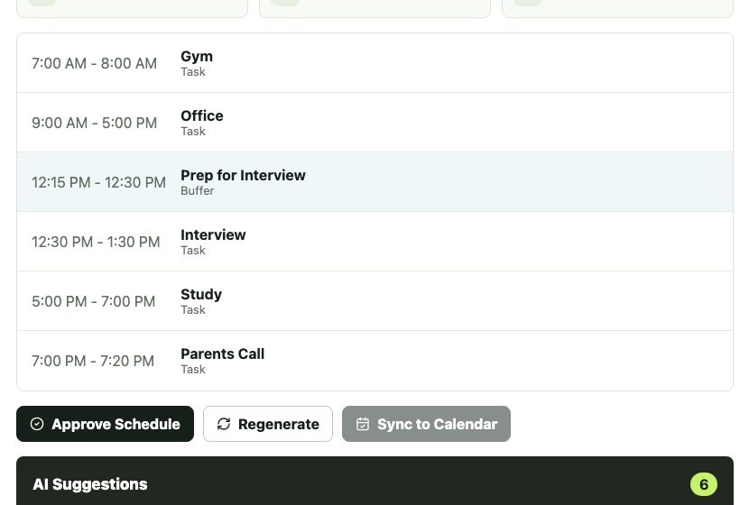
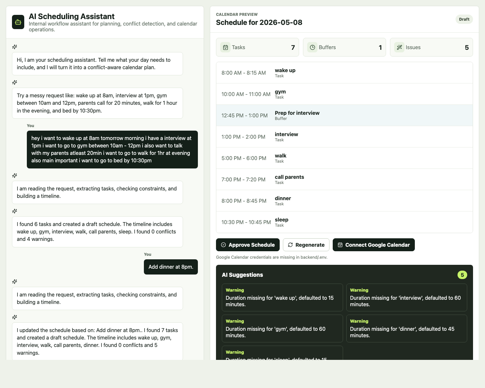
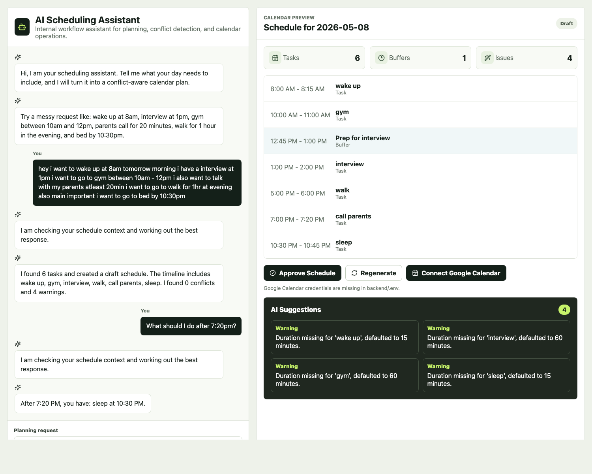

# Personal AI Scheduling Assistant

An AI-powered scheduling workflow system with a company-style chatbot interface. Users chat with an AI assistant, an LLM extracts structured task candidates, the backend validates them, and a deterministic scheduling engine generates a calendar-ready daily timeline.

This is intentionally more than a calendar chatbot: the LLM does structured extraction, but backend validation and scheduling code own correctness.


## Product Flow

```text
User chats with AI
  -> LLM extracts structured tasks
  -> Backend validates and normalizes tasks
  -> Scheduling engine creates schedule
  -> Conversation memory stores schedule context
  -> User reviews timeline and suggestions
  -> User approves
  -> Calendar sync
```

The frontend is designed like an internal SaaS AI assistant:

- Left side: chatbot conversation with user and AI messages.
- Right side: generated timeline/calendar preview.
- Review area: conflicts, suggested fixes, and validation warnings.
- Workflow actions: Generate Schedule, Approve Schedule, Regenerate, Sync to Calendar.

## Demo Workflow

Input:

```text
hey i want to wake up at 8am tomorrow morning i have a interview at 1pm
i want to go to gym between 10am - 12pm i also want to talk with my parents
atleast 20min i want to go to walk for 1hr at evening also main important
i want to go to bed by 10:30pm
```

Expected extraction:

| Task | Type | Constraint |
| --- | --- | --- |
| Wake Up | Fixed | 8:00 AM |
| Gym | Flexible | between 10:00 AM and 12:00 PM |
| Interview | Fixed | 1:00 PM |
| Parents Call | Flexible | 20 minutes |
| Walk | Flexible | evening, 60 minutes |
| Sleep | Deadline | by 10:30 PM |

## Screenshots

Screenshots are stored in `docs/screenshots/`.

| Conversational Assistant | Schedule Timeline |
| --- | --- |
|  |  |

| Schedule Modification | Calendar Sync State |
| --- | --- |
|  |  |

## Features

- Chat-first natural language planning interface.
- Friendly AI scheduling summary after generation.
- Calendar preview with timeline, task counts, buffers, and issue counts.
- Approval workflow with Approve Schedule, Regenerate, and Sync to Calendar actions.
- Conversation memory for the active session.
- Follow-up questions like `Do I have free time before bed?` or `What tasks are pending?`.
- Schedule modification requests like `Move gym to evening` or `Add dinner at 8pm`.
- OpenAI-powered structured task extraction through `OPENAI_API_KEY`.
- Retry once with a stricter extraction prompt if the LLM merges multiple intents.
- Local fallback parser for demos and missing API key handling.
- Task validation for missing durations, overlaps, and impossible fixed-time plans.
- Algorithmic scheduling engine for fixed and flexible tasks.
- Time-window support for constraints like `between 10am and 12pm`.
- Deadline support for constraints like `sleep by 10:30pm`.
- Priority-based flexible task placement.
- Automatic prep buffers for high-priority events.
- Conflict and suggestion output.
- Calendar sync boundary for future Google Calendar OAuth.
- Google Calendar OAuth routes and event sync when credentials are configured.

## Architecture

```text
React Chatbot Assistant
  -> FastAPI Backend
  -> LLM Structured Extraction Layer
  -> Task Validation Layer
  -> Scheduling and Optimization Engine
  -> Conversation Memory
  -> Workflow Orchestration Layer
  -> Google Calendar OAuth + Event Sync
```

The key design decision is separation of concerns:

- LLM: extracts intent into structured task candidates.
- Validator: treats extracted data as untrusted and checks it.
- Scheduler: deterministically allocates time blocks and detects conflicts.
- Orchestrator: manages lifecycle, persistence, and calendar sync boundaries.

## Project Structure

```text
personal-ai-scheduler/
  backend/     FastAPI, AI extraction, validation, scheduling, orchestration
  frontend/    React + Vite dashboard
  docs/        Architecture, screenshots, and interview notes
```

## Run Backend

```bash
cd backend
python -m venv .venv
source .venv/bin/activate
pip install -r requirements.txt
cp .env.example .env
uvicorn app.main:app --reload --port 8000
```

Set your OpenAI key locally in `backend/.env`:

```bash
OPENAI_API_KEY=your_real_key_here
```

Never commit `.env`. It is already ignored by `.gitignore`.

Health check:

```bash
curl http://127.0.0.1:8000/health
```

## Run Frontend

```bash
cd frontend
npm install
npm run dev
```

Open:

```text
http://localhost:5173
```

Demo mode:

```text
http://localhost:5173/?demo=1
```

## API Example

```bash
curl -X POST http://127.0.0.1:8000/api/schedules/generate \
  -H "Content-Type: application/json" \
  -d '{"text":"Tomorrow gym at 7am, office at 9am, interview at 12:30pm, parents call for 20 mins, study 2 hours."}'
```

## Google Calendar Setup

Create OAuth credentials in Google Cloud Console and add these values to `backend/.env`:

```bash
GOOGLE_CLIENT_ID=your_google_client_id_here
GOOGLE_CLIENT_SECRET=your_google_client_secret_here
GOOGLE_REDIRECT_URI=http://localhost:8000/auth/google/callback
```

Add the redirect URI above to your Google OAuth client.

Calendar endpoints:

```text
GET  /auth/google/login
GET  /auth/google/callback
POST /calendar/sync
```

If credentials are missing, the UI shows a clear `Calendar sync is not connected` setup message instead of silently failing.

## Example Prompts

```text
hey i want to wake up at 8am tomorrow morning i have a interview at 1pm i want to go to gym between 10am - 12pm i also want to talk with my parents atleast 20min i want to go to walk for 1hr at evening also main important i want to go to bed by 10:30pm
```

```text
Plan tomorrow: wake up at 6am, deep work for 2 hours, team meeting at 11am, lunch, study 90 minutes, sleep by 10:30pm.
```

```text
Move gym to evening and keep all meetings after lunch.
```

```text
What should I do after 7:20pm?
```

```text
Can I fit 1 hour of study?
```

## Recruiter Explanation

Short version:

> This is an AI workflow automation app for scheduling. The LLM extracts tasks from natural language, then the backend validates constraints and uses a deterministic scheduler to build a conflict-aware calendar timeline.

Deep technical version:

[docs/interview_explanation.md](docs/interview_explanation.md)

## Production Roadmap

- PostgreSQL storage with user accounts.
- JWT authentication.
- Google OAuth 2.0 token storage with encryption.
- Google Calendar event create/update/delete.
- Drag-and-drop rescheduling.
- Recurring task expansion.
- Email, SMS, and push reminders.
- Background sync retries and failure logging.
- Evaluation set for LLM extraction quality.
