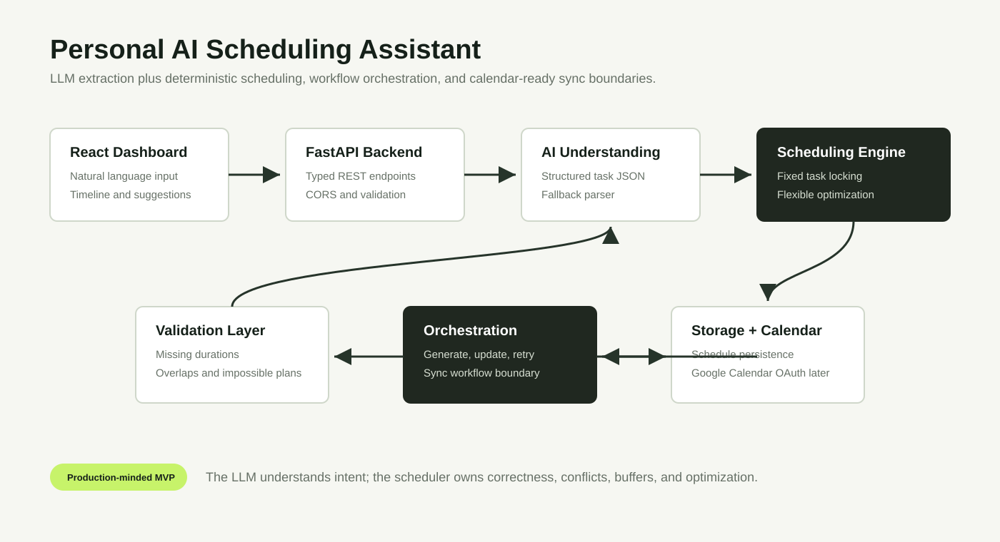

# Architecture



## Flow

```text
React Chatbot Assistant
  -> FastAPI Backend
  -> LangGraph Assistant Orchestrator
  -> Intent Detection
  -> Backend Tool Nodes
  -> SQLite Conversation Memory
  -> LLM Structured Extraction Layer
  -> Task Validation Layer
  -> Scheduling and Optimization Engine
  -> Workflow Orchestration Layer
  -> SQLite/PostgreSQL-ready Storage
  -> Google Calendar OAuth + Event Sync
```

## Backend Modules

- `ai_extraction_service.py`: converts natural language into structured task candidates.
- `task_validation_service.py`: checks missing durations, invalid dates, overlaps, and impossible windows.
- `scheduling_engine.py`: locks fixed tasks, finds open slots, schedules flexible work, and emits suggestions.
- `workflow_orchestrator.py`: coordinates extraction, validation, scheduling, persistence, and calendar sync.
- `assistant_service.py`: uses LangGraph to load memory, classify intent, call scheduling/question/modification/sync tool nodes, and persist the response.
- `conversation_memory_service.py`: stores chat turns, latest plan text, latest schedule JSON, and user preferences in SQLite for the MVP.
- `calendar_sync_service.py`: handles Google OAuth URLs, token exchange, and event creation for scheduled tasks.

## Why LLM + Algorithm

The LLM is useful for language understanding, but the project does not trust the LLM to decide the final calendar. OpenAI extracts structured task candidates; those candidates move through validation, normalization, and deterministic scheduling before anything is considered calendar-ready.

This makes the system safer and easier to explain:

- Natural language ambiguity is handled by the AI task understanding layer.
- Correctness is handled by typed schemas, validation, and scheduling code.
- Calendar sync is isolated behind a service boundary for retries and OAuth handling.

## Conversation Flow

The assistant stores the latest schedule, extracted tasks, timeline, conflicts, warnings, free-time context, and preferences for the active session. Follow-up questions use this context instead of generating a new schedule every time.

LangGraph runs the assistant as a small tool graph:

```text
load_memory
  -> classify_intent
  -> create_schedule | answer_question | modify_schedule | sync_calendar
  -> persist_memory
```

The LLM can classify intent and extract tasks, but it does not directly mutate the calendar. The graph routes to backend tools that validate, schedule, update memory, and return typed responses.

Supported intents:

- `create_schedule`
- `ask_question`
- `modify_schedule`
- `add_task`
- `remove_task`
- `optimize_schedule`
- `sync_calendar`

## Calendar Sync Flow

```text
Frontend Connect Google Calendar
  -> GET /auth/google/login
  -> Google OAuth consent
  -> GET /auth/google/callback
  -> tokens stored in backend memory for MVP
  -> POST /calendar/sync
  -> create Google Calendar events
```

## Production Roadmap

- Replace SQLite development storage with PostgreSQL.
- Add user accounts, JWT auth, and encrypted OAuth token storage.
- Enable Google Calendar OAuth 2.0 event create/update/delete.
- Add drag-and-drop rescheduling persistence.
- Add recurring task expansion.
- Add notification jobs with Celery or a managed queue.
- Add observability for AI extraction failures, schedule conflicts, and calendar sync retries.
